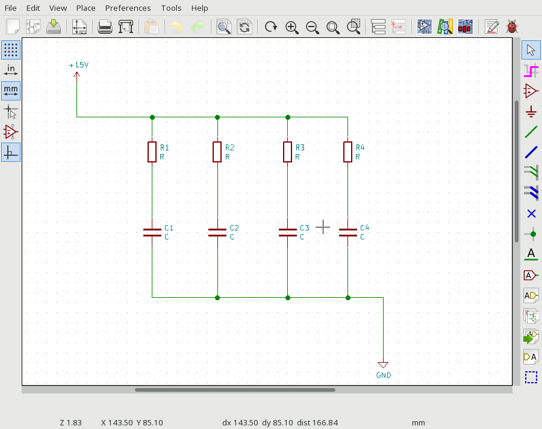
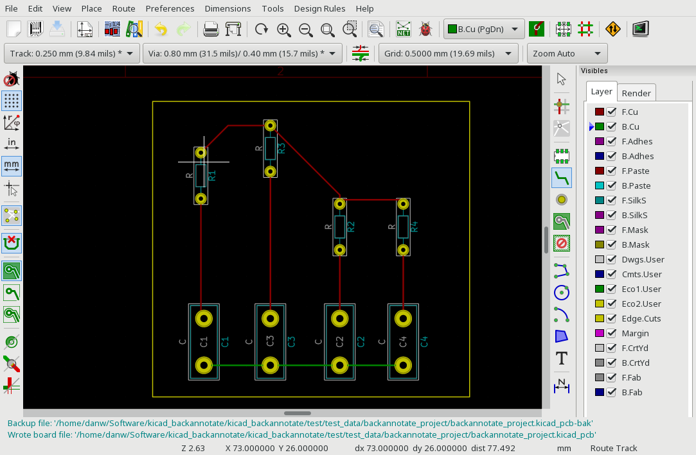
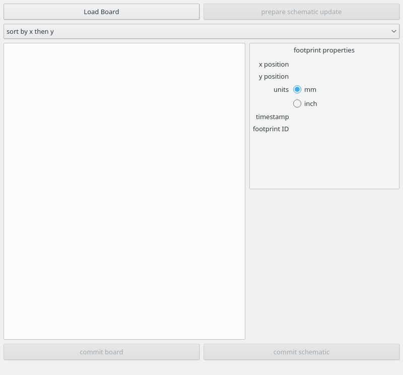
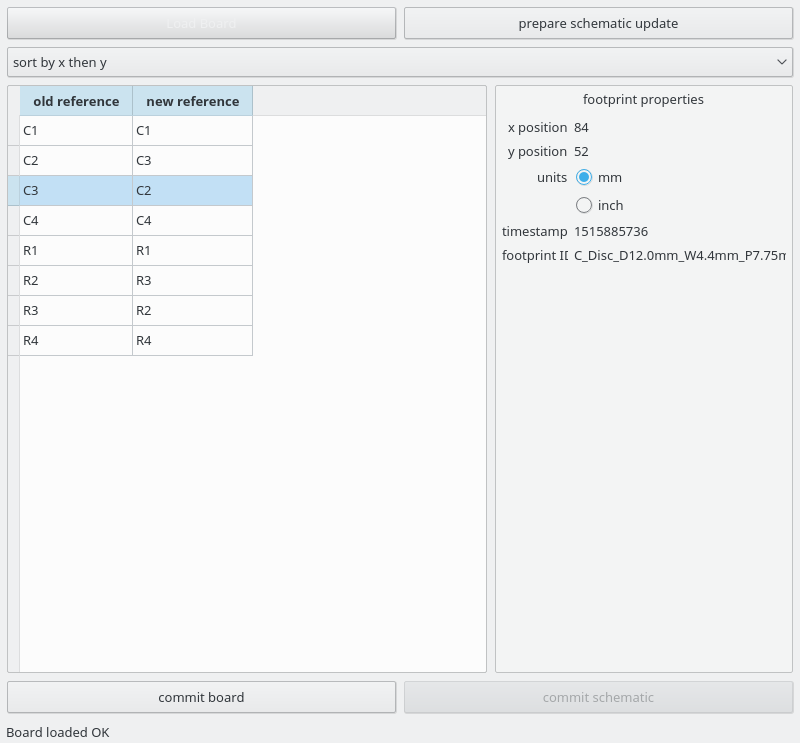
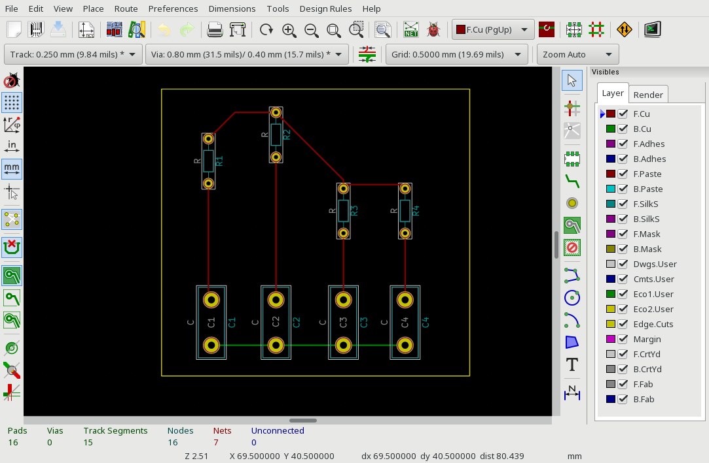
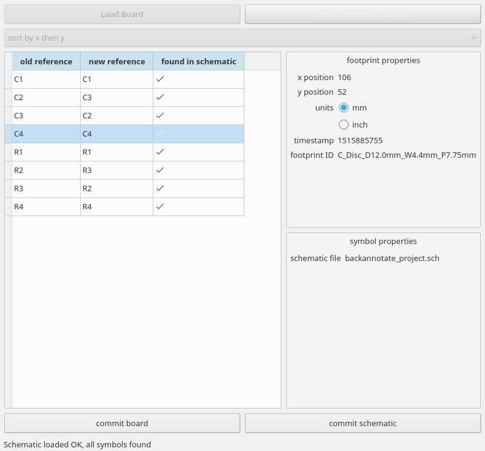
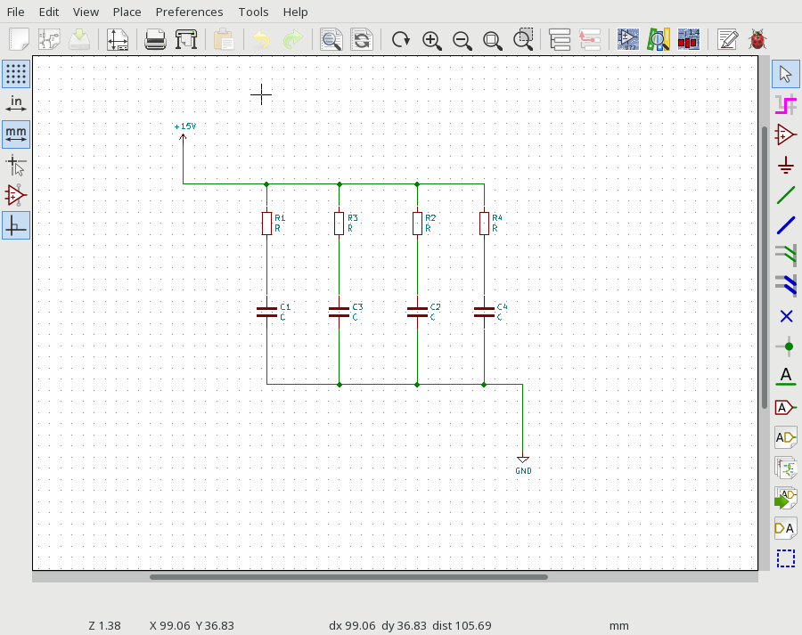

Basic Usage Tutorial (GUI)
==========================

we will use kicad_backannotate to re-order the part references on a very simple kicad schematic (shown in :numref:`schematic`).

.. _schematic:

	A simple schematic containing four resistors and four capacitors

In order to use kicad_backannotate, the starting point is a schematic which is already annotated, and a pcb which is already laid out (as seen in :numref:`layout`).
Note that, for whatever reason, we have chosen to place R3 to the left of R2 in the PCB layout (of course in this design it doesn't matter, but in a more complicated situation, it often arises that the order in which the schematic was annotated is not ideally suitable to layout). 

.. _layout:

	PCB layout for out simple schematic

Start up kicad_backannotate_gui. You should be greeted by the main window (:numref:`mainwindow`). The process of back-annotating proceeds through 4 steps:

1. Load the PCB and choose the geometric remapping desired

2. Export the remapped PCB and inspect to check the changes are satisfactory

3. Load the schematic project associated with the PCB, check that all remappings are correctly found

4. Export the back-annotated schematic project

.. _mainwindow:

	Main window of kicad_backannotate_gui

To load the board, click on the "Load Board" button. After choosing a .kicad_pcb file, you should see a list of the component references on the boad in the kicad_backannotate_gui window, along with the proposed new reference after re-mapping. Selecting a component shows you the geometric position on the PCB. You can select a different geometric remapping by changing the value "sort by x then y" combo box (the window should look like :numref:`boardloaded`)

.. _boardloaded:

	After loading a board and selecting a component

To verify the re-mapping, click the "commit board" button. You will be asked for a filename to save the re-mapped board to. This should be *different* than the original board, to avoid losing your hard layout work in case something goes wrong! You can now load this board in pcbnew, and see that the component references are now geometrically mapped (see :numref:`remappedboard`).

.. _remappedboard:

	The PCB after re-mapping (note that C2 and C3 are switched)

Now, choose the "prepare schematic update" button, and choose the schematic file associated with the board layout. Note that kicad_backannotate can handle hierarchical schematics, but you must always choose the top level schematic, otherwise some reference updates will be unsuccessful. After loading the schematic, check that all the components have been successfully found, indicated by the tick icon in the remapping table (should look like :numref:`loadedschem`)

.. _loadedschem:

	The schematic has been loaded, and all remappings successfully found

Finally, click the "commit schematic" button. You will be asked for a suffix to the schematic filename (kicad_backannotate will save the back-annotated schematics to new files, so that the original is not overwritten, unless this box is empty). If your original schematic was named "amplifier.sch" for example, and you enter "_remapped" in the box, the resulting schematic will be named "amplifier_remapped.sch". For a hierarchical schematic, kicad_backannotate will go through every file in the hierarchy, renaming the sheets so that the new filenames are found rather than the old. The resulting re-mapped schematic can be seen in :numref:`remappedschem`

.. _remappedschem:

	The successfully remapped schematic

